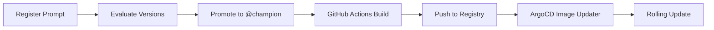

<a id="readme-top"></a>

<!-- PROJECT LOGO & TITLE -->

<div align="center">
  <a href="https://github.com/opencloudhub">
  <picture>
    <source media="(prefers-color-scheme: light)" srcset="https://raw.githubusercontent.com/opencloudhub/.github/main/assets/brand/assets/logos/primary-logo-light.svg">
    <source media="(prefers-color-scheme: dark)" srcset="https://raw.githubusercontent.com/opencloudhub/.github/main/assets/brand/assets/logos/primary-logo-dark.svg">
    <!-- Fallback -->
    
  </picture>
  </a>

<h1 align="center">Demo App GenAI Backend</h1>

<p align="center">
    Demo RAG system with prompt versioning, automated evaluation, and GitOps deployment.<br />
    <a href="https://github.com/opencloudhub"><strong>Explore OpenCloudHub »</strong></a>
  </p>
</div>

______________________________________________________________________

<details>
  <summary>📑 Table of Contents</summary>
  <ol>
    <li><a href="#about">About</a></li>
    <li><a href="#thesis-context">Thesis Context</a></li>
    <li><a href="#features">Features</a></li>
    <li><a href="#architecture">Architecture</a></li>
    <li><a href="#getting-started">Getting Started</a></li>
    <li><a href="#configuration">Configuration</a></li>
    <li><a href="#mlops-workflow">MLOps Workflow</a></li>
    <li><a href="#project-structure">Project Structure</a></li>
    <li><a href="#contributing">Contributing</a></li>
    <li><a href="#license">License</a></li>
    <li><a href="#contact">Contact</a></li>
  </ol>
</details>

______________________________________________________________________

<h2 id="about">🎯 About</h2>

A production-ready Retrieval-Augmented Generation (RAG) system that answers questions about OpenCloudHub's MLOps platform by retrieving relevant information from README files across multiple repositories.

The system demonstrates **MLOps best practices in the context of GenAI applications**, including:

- 🔍 **Semantic search** over OpenCloudHub repository READMEs
- 💬 **Context-aware question answering** with streaming responses and chat history
- 📊 **Automated prompt evaluation** with LLM-as-judge scoring
- 🚀 **GitOps-based deployment** with ArgoCD Image Updater
- 🎯 **MLflow-based experiment tracking** and prompt registry

______________________________________________________________________

<h2 id="thesis-context">📚 Thesis Context</h2>

This repository is part of the **OpenCloudHub MLOps platform demonstration**, showcasing how to operationalize GenAI applications with proper MLOps practices:

| Aspect                | Implementation                                                   |
| --------------------- | ---------------------------------------------------------------- |
| **Prompt Versioning** | MLflow Prompt Registry with semantic aliases (`@champion`)       |
| **Evaluation**        | Automated scoring with custom metrics + LLM-as-judge             |
| **Data Versioning**   | DVC-tracked evaluation datasets                                  |
| **Deployment**        | GitOps via ArgoCD with automatic image updates                   |
| **Observability**     | OpenTelemetry tracing → Tempo, Prometheus metrics                |
| **Self-Hosted LLM**   | Integration with Qwen model served via Ray Serve on the platform |

______________________________________________________________________

<h2 id="features">✨ Features</h2>

### RAG System

- **Hybrid Search**: Combines semantic (pgvector) and keyword (PostgreSQL FTS) search with reciprocal rank fusion
- **Streaming Responses**: Server-Sent Events (SSE) for real-time token streaming
- **Session Management**: PostgreSQL-backed chat history across multiple queries
- **Production-Ready Serving**: FastAPI with health checks, metrics, and graceful shutdown

### MLOps Pipeline

- **Prompt Versioning**: MLflow Prompt Registry with `@champion` alias for production
- **Automated Evaluation**: Compare prompt versions using custom scorers and LLM-as-judge
- **Auto-Promotion**: Best-performing prompts automatically promoted to production
- **Data Versioning**: DVC-tracked evaluation datasets with lineage
- **CI/CD Integration**: GitHub Actions for quality checks and Docker builds
- **GitOps Deployment**: ArgoCD with automatic image updates on promotion

### Observability

- **Distributed Tracing**: OpenTelemetry → Tempo for end-to-end request tracing
- **Prometheus Metrics**: Request counts, latency histograms, with trace exemplars
- **Log Correlation**: Automatic trace_id/span_id injection into logs
- **Experiment Tracking**: MLflow for prompt evaluation metrics and comparison

______________________________________________________________________

<h2 id="architecture">🏗️ Architecture</h2>

### System Components

```
┌─────────────────────────────────────────────────────────────────┐
│                     Prompt Evaluation Pipeline                  │
├─────────────────────────────────────────────────────────────────┤
│                                                                 │
│  ┌──────────────┐                        ┌──────────────┐       │
│  │   Prompt     │ prompt v1, v2, v3...   │  Evaluation  │       │
│  │  Registry    │──────────┐             │   Dataset    │       │
│  │  (MLflow)    │          │             │    (DVC)     │       │
│  └──────────────┘          │             └──────────────┘       │
│                            │                     │              │
│                            ▼                     ▼              │
│                      ┌───────────────────────────────┐          │
│                      │     Automated Evaluation      │          │
│                      │  ┌─────────────────────────┐  │          │
│                      │  │ For each prompt version │  │          │
│                      │  │ + each Q&A pair:        │  │          │
│                      │  │ • Run RAG pipeline      │  │          │
│                      │  │ • Score vs expected     │  │          │
│                      │  │ • LLM-as-judge quality  │  │          │
│                      │  └─────────────────────────┘  │          │
│                      └───────────────────────────────┘          │
│                                     │                           │
│                                     ▼                           │
│                            ┌──────────────┐                     │
│                            │   Promote    │                     │
│                            │  @champion   │                     │
│                            └──────────────┘                     │
│                                                                 │
└─────────────────────────────────────────────────────────────────┘
                                │
                                ▼
┌─────────────────────────────────────────────────────────────────┐
│                     Production Runtime                          │
├─────────────────────────────────────────────────────────────────┤
│                                                                 │
│   ┌──────────────┐     ┌──────────────┐     ┌──────────────┐    │
│   │   FastAPI    │───▶│  RAG Chain   │───▶│  PostgreSQL  │    │
│   │   + OTEL     │     │  (LangChain) │     │  + pgvector  │    │
│   └──────────────┘     └──────────────┘     └──────────────┘    │
│          │                     │                     │          │
│          ▼                     ▼                     ▼          │
│   ┌──────────────┐     ┌──────────────┐     ┌──────────────┐    │
│   │    Tempo     │     │  Qwen LLM    │     │ Chat History │    │
│   │   (Traces)   │     │  (KServe)    │     │  (Postgres)  │    │
│   └──────────────┘     └──────────────┘     └──────────────┘    │
│                                                                 │
└─────────────────────────────────────────────────────────────────┘
                                │
                                ▼
┌─────────────────────────────────────────────────────────────────┐
│                     GitOps Deployment (ArgoCD)                   │
├─────────────────────────────────────────────────────────────────┤
│   GitHub Actions → Docker Build → Registry → ArgoCD → K8s       │
└─────────────────────────────────────────────────────────────────┘
```

### Data Flow

1. **Query**: User question → Hybrid retrieval (semantic + keyword) → Context + Prompt → LLM → Streamed answer
1. **Evaluation**:
   - Load prompt versions from MLflow (v1, v2, v3...)
   - Load Q&A dataset from DVC (`question`, `expected_answer`, `key_concepts`, `category`)
   - For each prompt × each question: run RAG, score answer vs expected
   - Promote best-scoring prompt to `@champion`
1. **Deployment**: GitHub Actions → Docker build → Push to registry → ArgoCD watches → Rolling update

______________________________________________________________________

<h2 id="getting-started">🚀 Getting Started</h2>

### Prerequisites

- Docker & Docker Compose
- VS Code with DevContainers extension (recommended)
- Access to:
  - PostgreSQL database with pgvector extension
  - OpenAI-compatible LLM endpoint
  - MLflow tracking server
  - MinIO/S3 for DVC storage

### Quick Start

1. **Clone the repository**

   ```bash
   git clone https://github.com/OpenCloudHub/demo-app-genai-backend.git
   cd demo-app-genai-backend
   ```

1. **Open in DevContainer**

   VSCode: `Ctrl+Shift+P` → `Dev Containers: Rebuild and Reopen in Container`

1. **Configure environment**

   ```bash
   # For minikube deployment (with port-forwarding)
   cp .env.minikube .env

   # Apply environment variables
   set -a && source .env && set +a
   ```

1. **Port-forward required services** (if connecting to minikube from local repo)

   ```bash
   # PostgreSQL
   kubectl port-forward -n storage svc/demo-app-db-cluster-rw 5432:5432 &

   # OTEL collector (Alloy)
   kubectl port-forward -n observability svc/k8s-monitoring-alloy-receiver 4317:4317 &
   ```

1. **Run the API**

   ```bash
   # Development mode with auto-reload
   fastapi dev src/main.py

   # Production mode
   uvicorn src.main:app --host 0.0.0.0 --port 8000
   ```

1. **Test the API**

   ```bash
   # Simple query
   curl -X POST http://localhost:8000/api/query \
     -H "Content-Type: application/json" \
     -d '{"question": "What is GitOps in OpenCloudHub?"}'

   # Streaming with Server-Sent Events
   curl -N -X POST http://localhost:8000/api/query \
     -H "Content-Type: application/json" \
     -H "Accept: text/event-stream" \
     -d '{"question": "What is GitOps in OpenCloudHub?", "stream": true}'
   ```

______________________________________________________________________

<h2 id="configuration">⚙️ Configuration</h2>

### Environment Variables

All configuration is managed via environment variables (Pydantic Settings):

| Variable                      | Description                  | Default             |
| ----------------------------- | ---------------------------- | ------------------- |
| `DB_HOST`                     | PostgreSQL host              | `127.0.0.1`         |
| `DB_PORT`                     | PostgreSQL port              | `5432`              |
| `DB_NAME`                     | Database name                | `demo_app`          |
| `DB_USER`                     | Database user                | *required*          |
| `DB_PASSWORD`                 | Database password            | *required*          |
| `DB_TABLE_NAME`               | Embeddings table             | `readme_embeddings` |
| `DB_TOP_K`                    | Number of docs to retrieve   | `10`                |
| `MLFLOW_TRACKING_URI`         | MLflow server URL            | *required*          |
| `PROMPT_NAME`                 | Prompt name in registry      | `readme-rag-prompt` |
| `LLM_BASE_URL`                | OpenAI-compatible API URL    | *required*          |
| `LLM_MODEL`                   | Model name                   | *required*          |
| `EMBEDDING_MODEL`             | Sentence transformer model   | *required*          |
| `OTEL_ENABLED`                | Enable OpenTelemetry tracing | `true`              |
| `OTEL_EXPORTER_OTLP_ENDPOINT` | OTLP gRPC endpoint           | `localhost:4317`    |

### API Endpoints

| Endpoint                    | Method | Description                         |
| --------------------------- | ------ | ----------------------------------- |
| `/api/`                     | GET    | Service info                        |
| `/api/health`               | GET    | Health check with prompt version    |
| `/api/query`                | POST   | Ask a question (supports streaming) |
| `/api/session/create`       | POST   | Create a new chat session           |
| `/api/session/{id}/history` | GET    | Get session chat history            |
| `/api/session/{id}`         | DELETE | Clear session history               |
| `/api/admin/reload-prompt`  | POST   | Hot-reload prompt version           |
| `/api/debug/retrieval`      | POST   | Debug document retrieval            |
| `/metrics`                  | GET    | Prometheus metrics                  |

______________________________________________________________________

<h2 id="mlops-workflow">🔄 MLOps Workflow</h2>

### 1. Prompt Development

Register new prompt versions in MLflow:

```bash
python src/prompts/register_prompts.py
```

This registers multiple prompt versions (V1: baseline, V2: medium, V3: optimized) for A/B testing.

### 2. Automated Evaluation

Run evaluation to compare prompt versions:

```bash
# Local execution
python src/prompts/evaluate_promts.py \
    --prompt-name readme-rag-prompt \
    --prompt-versions 1 2 3 \
    --dvc-data-version opencloudhub-readmes-rag-evaluation-v1.0.0 \
    --auto-promote

# Via GitHub Actions
gh workflow run evaluate-and-promote-rag.yaml \
    -f prompt_name=readme-rag-prompt \
    -f prompt_versions="1 2 3" \
    -f data_version=opencloudhub-readmes-rag-evaluation-v1.0.0
```

**Evaluation Process:**

1. Loads evaluation dataset from DVC (versioned questions + expected answers)
1. Runs each prompt version through the RAG pipeline
1. Computes metrics:
   - **Concept Coverage**: Checks if key concepts are mentioned in the answer
   - **LLM-as-Judge**: Quality assessment using the same LLM
1. Calculates composite score (60% concept + 40% judge)
1. Promotes best prompt to `@champion` alias

### 3. Hot Reload in Production

After promotion, reload the running API without restart:

```bash
curl -X POST http://localhost:8000/api/admin/reload-prompt \
  -H "Content-Type: application/json" \
  -d '{"prompt_version": null, "top_k": 5}'  # null loads @champion
```

### 4. Continuous Deployment



______________________________________________________________________

<h2 id="project-structure">📁 Project Structure</h2>

```
demo-app-genai-backend/
├── .github/
│   └── workflows/
│       ├── ci-code-quality.yaml          # Ruff linting, type checks
│       ├── ci-docker-build-push.yaml     # Multi-stage Docker builds
│       └── evaluate-and-promote-rag.yaml # Automated evaluation pipeline
│
├── src/
│   ├── main.py                           # FastAPI application entry point
│   ├── api/
│   │   ├── deps.py                       # FastAPI dependencies
│   │   └── routes/
│   │       ├── admin.py                  # Prompt reload endpoint
│   │       ├── debug.py                  # Debug/retrieval testing
│   │       ├── health.py                 # Health checks
│   │       ├── query.py                  # Main query endpoint
│   │       └── session.py                # Chat session management
│   ├── core/
│   │   ├── config.py                     # Pydantic settings
│   │   ├── database.py                   # Database connection manager
│   │   ├── logging.py                    # Loguru configuration
│   │   └── tracing.py                    # OpenTelemetry + Prometheus
│   ├── prompts/
│   │   ├── evaluate_promts.py            # MLflow GenAI evaluation
│   │   └── register_prompts.py           # Prompt registration
│   ├── rag/
│   │   ├── chain.py                      # RAGChain with LangChain
│   │   └── embeddings.py                 # SentenceTransformer wrapper
│   └── schemas/                          # Pydantic request/response models
│
├── scripts/
│   ├── debug_retrieval.py                # Test retrieval quality
│   └── test_streaming_curl.sh            # Test SSE streaming
│
├── tests/
│   └── test_streaming.py                 # Streaming response tests
│
├── .env.minikube                         # Minikube environment template
├── Dockerfile                            # Multi-stage production build
├── pyproject.toml                        # Python dependencies (uv)
└── README.md
```

______________________________________________________________________

<h2 id="contributing">👥 Contributing</h2>

Contributions are welcome! This project follows OpenCloudHub's contribution standards.

Please see our [Contributing Guidelines](https://github.com/opencloudhub/.github/blob/main/.github/CONTRIBUTING.md) and [Code of Conduct](https://github.com/opencloudhub/.github/blob/main/.github/CODE_OF_CONDUCT.md).

**Development workflow:**

1. Fork the repository
1. Create a feature branch (`git checkout -b feature/amazing-feature`)
1. Make changes with tests
1. Run quality checks (`ruff check . && ruff format .`)
1. Commit (`git commit -m 'Add amazing feature'`)
1. Push to branch (`git push origin feature/amazing-feature`)
1. Open a Pull Request

______________________________________________________________________

<h2 id="license">📄 License</h2>

Distributed under the Apache 2.0 License. See [LICENSE](LICENSE) for more information.

______________________________________________________________________

<h2 id="contact">📬 Contact</h2>

**Organization:** [OpenCloudHub](https://github.com/OpenCloudHub)

**Project:** [demo-app-genai-backend](https://github.com/OpenCloudHub/demo-app-genai-backend)

______________________________________________________________________

<h2 id="acknowledgements">🙏 Acknowledgements</h2>

- [LangChain](https://python.langchain.com/) - RAG orchestration framework
- [FastAPI](https://fastapi.tiangolo.com/) - Modern async web framework
- [MLflow](https://mlflow.org/) - ML lifecycle management & prompt registry
- [DVC](https://dvc.org/) - Data version control
- [pgvector](https://github.com/pgvector/pgvector) - Vector similarity search for PostgreSQL
- [OpenTelemetry](https://opentelemetry.io/) - Observability framework
- [ArgoCD](https://argo-cd.readthedocs.io/) - GitOps continuous delivery

<p align="right">(<a href="#readme-top">back to top</a>)</p>

______________________________________________________________________

<div align="center">
  <h3>🌟 Follow the Journey</h3>
  <p><em>Building in public • Learning together • Sharing knowledge</em></p>

<div>
    <a href="https://opencloudhub.github.io/docs">
      
    </a>
    <a href="https://github.com/orgs/opencloudhub/discussions">
      
    </a>
    <a href="https://github.com/orgs/opencloudhub/projects/4">
      
    </a>
  </div>
</div>
