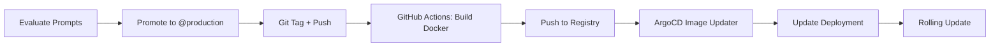

<a id="readme-top"></a>

<!-- PROJECT LOGO & TITLE -->

<div align="center">
  <a href="https://github.com/opencloudhub">
  <picture>
    <source media="(prefers-color-scheme: light)" srcset="https://raw.githubusercontent.com/opencloudhub/.github/main/assets/brand/assets/logos/primary-logo-light.svg">
    <source media="(prefers-color-scheme: dark)" srcset="https://raw.githubusercontent.com/opencloudhub/.github/main/assets/brand/assets/logos/primary-logo-dark.svg">
    <!-- Fallback -->
    
  </picture>
  </a>

<h1 align="center">Demo App GenAI Backend</h1>

<p align="center">
    Demo RAG system with prompt versioning, automated evaluation, and GitOps deployment.<br />
    <a href="https://github.com/opencloudhub"><strong>Explore OpenCloudHub »</strong></a>
  </p>
</div>

______________________________________________________________________

<details>
  <summary>📑 Table of Contents</summary>
  <ol>
    <li><a href="#about">About</a></li>
    <li><a href="#features">Features</a></li>
    <li><a href="#architecture">Architecture</a></li>
    <li><a href="#getting-started">Getting Started</a></li>
    <li><a href="#mlops-workflow">MLOps Workflow</a></li>
    <li><a href="#project-structure">Project Structure</a></li>
    <li><a href="#development">Development</a></li>
    <li><a href="#deployment">Deployment</a></li>
    <li><a href="#contributing">Contributing</a></li>
    <li><a href="#license">License</a></li>
    <li><a href="#contact">Contact</a></li>
  </ol>
</details>

______________________________________________________________________

<h2 id="about">🤖 About</h2>
<!-- TODO: make right -->
<!-- TODO: Add Chathistory -->

A demo Retrieval-Augmented Generation (RAG) system that answers questions about OpenCloudHub's MLOps platform by retrieving relevant information from README files across multiple repositories. The system demonstrates MLOps practices in the context of GenAI including prompt versioning, automated evaluation, and continuous deployment.

**Key Capabilities:**
- 🔍 Semantic search over OpenCloudHub repository READMEs
- 💬 Context-aware question answering with streaming responses
- 📊 Automated prompt evaluation and A/B testing
- 🚀 GitOps-based deployment with ArgoCD Image Updater
- 🎯 MLflow-based experiment tracking and prompt registry

______________________________________________________________________

<h2 id="features">✨ Features</h2>

### RAG System
- **Hybrid Search**: Combines semantic (pgvector) and keyword (PostgreSQL FTS) search with reciprocal rank fusion
- **Streaming Responses**: Server-Sent Events (SSE) for real-time token streaming
- **Session Management**: Track conversation history across multiple queries
- **Production-Ready-Serving**: FastAPI with health checks, metrics, and graceful shutdown

### MLOps Pipeline
- **Prompt Versioning**: MLflow Prompt Engineering with semantic versioning
- **Automated Evaluation**: Compare prompt versions using custom scorers and LLM-as-judge
- **Auto-Promotion**: Best-performing prompts automatically promoted to `@production`
- **Data Versioning**: DVC-tracked evaluation datasets with lineage
- **CI/CD Integration**: GitHub Actions for quality checks and Docker builds
- **GitOps Deployment**: ArgoCD with automatic image updates on promotion

### Observability
- **Distributed Tracing**: MLflow tracing for end-to-end request tracking
- **Experiment Tracking**: Compare prompt versions with standardized metrics
- **Prompt Registry**: Track prompt lineage

______________________________________________________________________

<h2 id="architecture">🏗️ Architecture</h2>

### System Components
<!-- TODO: adjust -->

```
┌─────────────────────────────────────────────────────────────────┐
│                        MLOps Pipeline                            │
├─────────────────────────────────────────────────────────────────┤
│                                                                   │
│  ┌──────────────┐      ┌──────────────┐      ┌──────────────┐  │
│  │   Prompt     │      │  Evaluation  │      │    Model     │  │
│  │  Registry    │─────▶│   Dataset    │─────▶│  Deployment  │  │
│  │  (MLflow)    │      │    (DVC)     │      │   (ArgoCD)   │  │
│  └──────────────┘      └──────────────┘      └──────────────┘  │
│         │                      │                      │          │
│         │                      ▼                      │          │
│         │              ┌──────────────┐              │          │
│         │              │  Automated   │              │          │
│         └─────────────▶│  Evaluation  │──────────────┘          │
│                        │  & Promotion │                         │
│                        └──────────────┘                         │
│                                                                   │
└─────────────────────────────────────────────────────────────────┘
                                │
                                ▼
┌─────────────────────────────────────────────────────────────────┐
│                     Production Runtime                           │
├─────────────────────────────────────────────────────────────────┤
│                                                                   │
│   ┌──────────────┐     ┌──────────────┐     ┌──────────────┐   │
│   │   FastAPI    │────▶│  RAG Chain   │────▶│  PostgreSQL  │   │
│   │   Service    │     │  (LangChain) │     │  + pgvector  │   │
│   └──────────────┘     └──────────────┘     └──────────────┘   │
│          │                     │                                 │
│          │                     ▼                                 │
│          │             ┌──────────────┐                         │
│          └────────────▶│   Our        │                         │
│                        │     LLM      │                         │
│                        └──────────────┘                         │
│                                                                   │
└─────────────────────────────────────────────────────────────────┘
```

### Data Flow

1. **Ingestion**: Repository READMEs → Chunking → Ray batch embeddings → PostgreSQL/pgvector
2. **Query**: User question → Hybrid retrieval → Context + Prompt → LLM → Streamed answer
3. **Evaluation**: Test prompts → Compute metrics → Promote best → Update deployment
4. **Deployment**: GitHub Actions → Docker build → ArgoCD watches → Automatic rollout

______________________________________________________________________

<h2 id="getting-started">🚀 Getting Started</h2>

### Prerequisites

- Docker & Docker Compose
- VS Code with DevContainers extension (recommended)
- Access to:
  - PostgreSQL database with pgvector
  - OpenAI-compatible LLM endpoint
  - MLflow tracking server
  - MinIO or S3 for DVC storage with example data pushed and versioned in your [Data Registry](https://github.com/OpenCloudHub/data-registry/tree/main/data/opencloudhub-readmes/rag-evaluation).

### Quick Start

1. **Clone the repository**

   ```bash
   git clone https://github.com/OpenCloudHub/demo-app-genai-backend.git
   cd readme-rag-agent
   ```

2. **Open in DevContainer**

   VSCode: `Ctrl+Shift+P` → `Dev Containers: Rebuild and Reopen in Container`

3. **Configure environment**

   ```bash
   cp .env.example .env
   # Edit .env with your credentials and conection string
   ```

   Required variables:
   ```bash
   source .env
   ```

4. **Install dependencies**

   ```bash
   uv sync
   source .venv/bin/activate
   ```

5. **Run the API**

   ```bash
   fastapi dev src/api/main.py
   ```

   Test query:
   ```bash
   curl -X POST http://localhost:8000/query \
     -H "Content-Type: application/json" \
     -d '{"question": "What is GitOps in OpenCloudHub?"}'
   ```
   or with streaming with Server-Sent Events (SSE):
   ```bash
    curl -N -X POST http://localhost:8000/query \
      -H "Content-Type: application/json" \
      -H "Accept: text/event-stream" \
      -d '{"question": "What is GitOps in OpenCloudHub?", "stream": true}'
   ```

______________________________________________________________________

<h2 id="mlops-workflow">🔄 MLOps Workflow</h2>

### 1. Prompt Development

**Create a new prompt version:**

```python
# scripts/register_prompts.py
import mlflow

mlflow.set_tracking_uri("https://mlflow.ai.internal.opencloudhub.org")

prompt_template = """
You are an expert on OpenCloudHub's MLOps platform.
Answer the following question using only the provided context.

Context: {context}

Question: {question}

Answer:"""

# Register new version
mlflow.set_prompt("readme-rag-prompt", prompt_template)
```

Run registration:
```bash
python scripts/register_prompts.py
```

This creates next version in MLflow Prompt Registry.

### 2. Automated Evaluation

**Trigger evaluation workflow:**

```bash
# Manually
python src/evaluation/evaluate_promts.py \
    --prompt-name readme-rag-prompt \
    --prompt-versions 1 2 3 4 \
    --data-version opencloudhub-readmes-rag-evaluation-v1.0.0 \
    --auto-promote

# Or via GitHub Actions
gh workflow run evaluate-and-promote-rag.yml \
    -f prompt_name=readme-rag-prompt \
    -f prompt_versions="1 2 3 4" \
    -f data_version=opencloudhub-readmes-rag-evaluation-v1.0.0
```

**What happens:**
1. Loads evaluation dataset from DVC (versioned questions + expected answers)
2. Runs each prompt version through the RAG pipeline
3. Computes metrics:
   - **Concept Coverage**: Are key concepts mentioned?
   - **LLM-as-Judge**: Quality assessment from another LLM
4. Calculates composite score (weighted average)
5. Promotes best prompt to `@production` alias
6. Logs all results to MLflow with comparison

**Example output:**
```
============================================================
COMPARISON
============================================================
 version  run_id    concept_coverage  llm_judge  composite
       1  a1b2c3d4              0.85       0.78       0.82
       2  e5f6g7h8              0.90       0.85       0.88
       3  i9j0k1l2              0.88       0.82       0.85
       4  m3n4o5p6              0.95       0.92       0.94

✓ Best version: 4
  Composite: 0.940
  Concept coverage: 0.950
  LLM judge: 0.920

Promoting version 4 to @production...
✓ Promoted!
```

### 3. Continuous Deployment

**When a new prompt is promoted:**
<!-- TODO: descivbe better, we build before in ci and reuse that container -->



**GitHub Actions workflow** (`.github/workflows/evaluate-and-promote-rag.yml`):

```yaml
name: Evaluate & Promote RAG

on:
  workflow_dispatch:
    inputs:
      prompt_versions:
        description: 'Prompt versions to evaluate'
        required: true
        default: '1 2 3'

jobs:
  evaluate:
    runs-on: ubuntu-latest
    steps:
      - name: Evaluate prompts
        run: |
          python src/evaluation/evaluate_promts.py \
            --prompt-versions ${{ inputs.prompt_versions }} \
            --auto-promote
      
      - name: Tag new version
        if: success()
        run: |
          git tag -a "prompt-v${BEST_VERSION}" -m "Auto-promoted prompt"
          git push origin "prompt-v${BEST_VERSION}"
```

**ArgoCD deployment** automatically picks up the new image and rolls out to production.

### 4. Production Runtime

**API loads the promoted prompt:**

```python
# src/api/main.py
@asynccontextmanager
async def lifespan(app: FastAPI):
    # Load prompt with @production alias
    app.state.chain = RAGChain(
        prompt_name="readme-rag-prompt",
        prompt_version=None,  # Uses @production alias
        # ... other config
    )
    yield
```

**Runtime flow:**
1. User sends question via `/query` endpoint
2. API retrieves context using hybrid search (pgvector + FTS)
3. Formats prompt with context and question
4. Streams LLM response token-by-token
5. Logs trace to MLflow for monitoring

______________________________________________________________________

<h2 id="project-structure">📁 Project Structure</h2>

```
readme-rag-agent/
├── .github/
│   └── workflows/
│       ├── ci-code-quality.yaml           # Ruff, type checks
│       ├── ci-docker-build-push.yaml      # Docker image builds
│       └── evaluate-and-promote-rag.yml   # Auto evaluation
│
├── src/
│   ├── api/
│   │   ├── main.py                        # FastAPI application
│   │   └── schemas.py                     # Request/response models
│   ├── rag/
│   │   └── chain.py                       # RAGChain implementation
│   ├── evaluation/
│   │   └── evaluate_promts.py             # Evaluation pipeline
│   ├── _config.py                         # Configuration management
│   └── _logging.py                        # Logging setup
│
├── scripts/
│   └── register_prompts.py                # Register prompt versions
│
├── tests/
│   ├── test_retrieval.py                  # Test vector search
│   └── test_streaming.py                  # Streaming response tests
│
├── .devcontainer/
│   ├── devcontainer.json                  # VS Code DevContainer
│   └── Dockerfile                         # Development environment
│
├── .dvc/
│   ├── config                             # DVC remote config
│   └── .gitignore                         # Ignore local config
│
├── .env.example                           # Environment template
├── pyproject.toml                         # Python dependencies
├── Dockerfile                             # Production image
└── README.md                              # This file
```

______________________________________________________________________

<h2 id="development">💻 Development</h2>

### Testing Locally

**Test the RAG chain:**
```bash
python scripts/test_retrieval.py
```

**Test streaming:**
```bash
python tests/test_streaming.py
```

**Test evaluation:**
```bash
python src/evaluation/evaluate_promts.py \
    --prompt-versions 1 2 \
    --auto-promote False  # Just compare, don't promote
```

### Adding Evaluation Data

1. **Prepare questions CSV:**
  Adjust the evaluation data found and tracked in the [Data Registry](https://github.com/OpenCloudHub/data-registry/tree/main/data/opencloudhub-readmes/rag-evaluation)
   ```csv
   question,expected_answer,key_concepts,category
   "What is GitOps?","ArgoCD manages deployments...","[""GitOps"",""ArgoCD""]",deployment
   ```

2. **Track with DVC:**
   ```bash
   dvc add data/opencloudhub-readmes/rag-evaluation/questions.csv
   dvc push
   git add data/opencloudhub-readmes/rag-evaluation/questions.csv.dvc
   git commit -m "Add evaluation dataset v1.1.0"
   git tag opencloudhub-readmes-rag-evaluation-v1.1.0
   git push origin main --tags
   ```

3. **Use in evaluation:**
   ```bash
   python src/evaluation/evaluate_promts.py \
       --data-version opencloudhub-readmes-rag-evaluation-v1.1.0
   ```

### Creating New Prompt Versions

**Iterative prompt engineering:**

```python
# 1. Create new version
prompt_v5 = """
You are an expert assistant for OpenCloudHub's MLOps platform.

Guidelines:
- Be concise but comprehensive
- Cite specific technologies mentioned in context
- If information is missing, say so clearly

Context: {context}
Question: {question}
Answer:"""

mlflow.set_prompt("readme-rag-prompt", prompt_v5)

# 2. Evaluate
python src/evaluation/evaluate_promts.py \
    --prompt-versions 4 5 \
    --auto-promote

# 3. If v5 wins, it becomes @production automatically
```

______________________________________________________________________

<h2 id="deployment">🚀 Deployment</h2>

### Docker Build

Building a new serving image happens during the automated CI/CD pipeline. Changes
on relevant files trigger a [Github Actions Workflow](.github/workflows/ci-docker-build-push.yaml) that calls a shared workflow that build and pushes the container to Dockerhub.

### Kubernetes Deployment

**ArgoCD Image Updater** automatically detects new images and updates the deployment.


### Health Checks

The API includes health endpoints:

```bash
# Liveness probe
curl http://localhost:8000/health

# Readiness probe  
curl http://localhost:8000/health
```

**Response:**
```json
{
  "status": "healthy",
  "prompt_version": 4,
  "uptime_seconds": 12345
}
```

______________________________________________________________________

<h2 id="contributing">👥 Contributing</h2>

Contributions are welcome! This project follows OpenCloudHub's contribution standards.

Please see our [Contributing Guidelines](https://github.com/opencloudhub/.github/blob/main/.github/CONTRIBUTING.md) and [Code of Conduct](https://github.com/opencloudhub/.github/blob/main/.github/CODE_OF_CONDUCT.md) for more details.

**Development workflow:**
1. Fork the repository
2. Create a feature branch (`git checkout -b feature/amazing-feature`)
3. Make your changes with tests
4. Run quality checks (`ruff check . && ruff format .`)
5. Commit (`git commit -m 'Add amazing feature'`)
6. Push to branch (`git push origin feature/amazing-feature`)
7. Open a Pull Request

______________________________________________________________________

<h2 id="license">📄 License</h2>

Distributed under the Apache 2.0 License. See [LICENSE](LICENSE) for more information.

______________________________________________________________________

<h2 id="contact">📬 Contact</h2>

Organization Link: [https://github.com/OpenCloudHub](https://github.com/OpenCloudHub)

Project Link: [https://github.com/opencloudhub/readme-rag-agent](https://github.com/opencloudhub/readme-rag-agent)

______________________________________________________________________

<h2 id="acknowledgements">🙏 Acknowledgements</h2>

- [LangChain](https://python.langchain.com/) - RAG orchestration framework
- [FastAPI](https://fastapi.tiangolo.com/) - Modern web framework
- [MLflow](https://mlflow.org/) - ML lifecycle management
- [DVC](https://dvc.org/) - Data version control
- [pgvector](https://github.com/pgvector/pgvector) - Vector similarity search
- [Ollama](https://ollama.ai/) - Local LLM inference
- [ArgoCD](https://argo-cd.readthedocs.io/) - GitOps continuous delivery

<p align="right">(<a href="#readme-top">back to top</a>)</p>